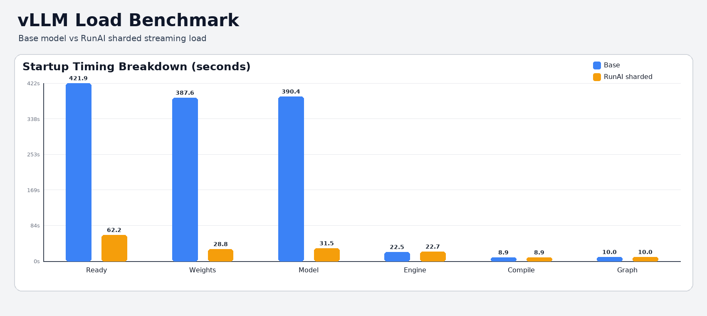

# GPT-OSS-120B F8_E8M0 RunAI Sharded Hotfix Results

## Summary
Native `F8_E8M0` handling in `runai_streamer_sharded` is not yet available.  
A custom hotfix was applied at runtime to enable sharded streaming load for `gpt-oss-120b` without changing model architecture.

Result: quality is unchanged vs base model on lm-eval, while vLLM load time is significantly faster with RunAI sharded streaming.

## Hotfix Scope
Hotfix implementation is in:
- `infer.py`
- `run_lm_eval_runai_sharded.py`

Applied runtime patches:
- Register `F8_E8M0` in RunAI safetensors streamer dtype mapping.
- Patch vLLM load order for `runai_streamer_sharded`.
- Patch sharded state loader handling for key mapping and scale tensors used during load.

## LM-Eval Parity (Base vs RunAI Sharded)
Run date: `2026-02-15`  
Tasks: `arc_easy,piqa`  
Limit: `20` (quick parity check)

| Task | Metric | Base | RunAI sharded |
|---|---|---:|---:|
| arc_easy | acc | 0.8000 | 0.8000 |
| arc_easy | acc_norm | 0.8000 | 0.8000 |
| piqa | acc | 0.7500 | 0.7500 |
| piqa | acc_norm | 0.8500 | 0.8500 |

Conclusion: base and sharded outputs are equivalent on this lm-eval comparison.

Detailed results: `LM_EVAL_RESULTS.md`

## vLLM Runtime Benchmark (Initialization / Load)
| Metric | Base | RunAI sharded | Speedup (Base/RunAI) |
|---|---:|---:|---:|
| Wall time to model ready (s) | 421.89 | 62.25 | 6.78x |
| Weights loading time (s) | 387.56 | 28.75 | 13.48x |
| Model loading time (s) | 390.37 | 31.53 | 12.38x |
| Engine init time (s) | 22.52 | 22.70 | 0.99x |
| torch.compile total (s) | 8.94 | 8.95 | ~1.00x |
| Graph capture time (s) | 10.00 | 10.00 | 1.00x |
| Model loading memory (GiB) | 34.38 | 34.38 | 1.00x |
| Graph capture memory (GiB) | 1.01 | 1.01 | 1.00x |

Detailed benchmark report: `benchmark_results/VLLM_LOAD_BENCHMARK.md`  
Raw parsed metrics: `benchmark_results/benchmark_metrics.json`
